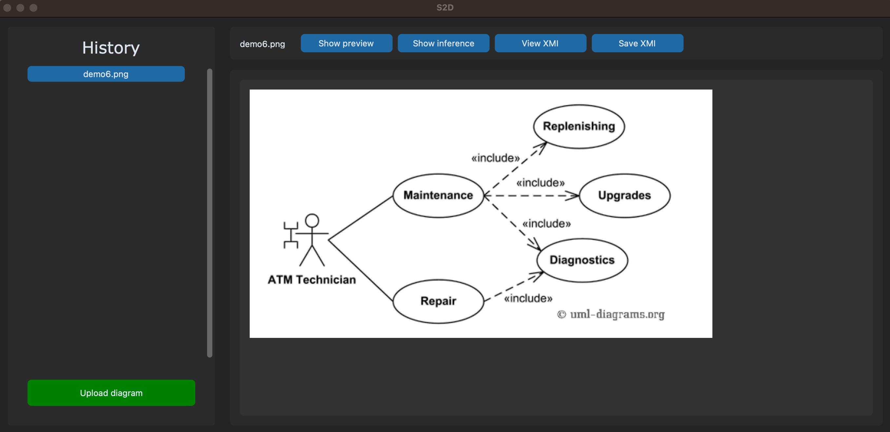
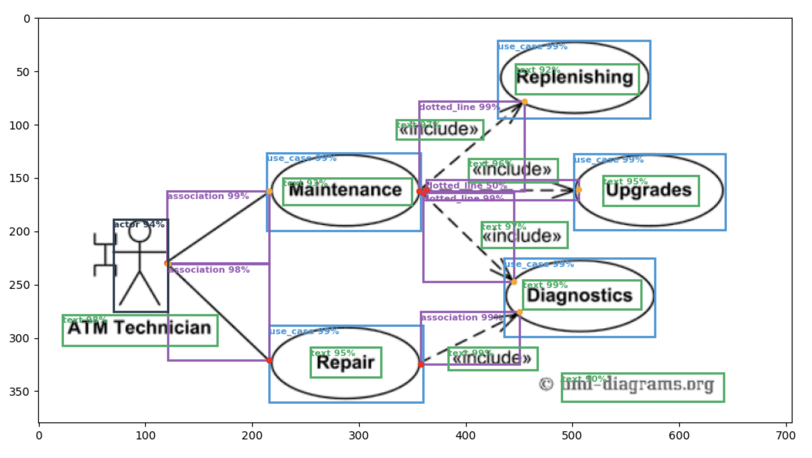
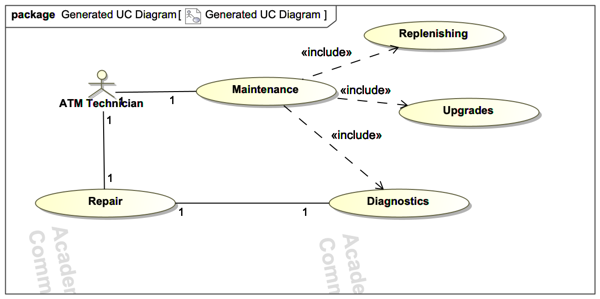

## 1. Clone project
```commandline
git clone git@github.com:pijoneris/s2d.git
```
## 2. Install dependencies
Although having Anaconda is not a requirement in order to use S2D, I suggest doing so, due to it’s intuitive way of managing packages and setting up new virtual environments. Anaconda is a pretty useful tool, not only for working with this project, but in general for anyone working in Python, so if you haven’t had a chance to work with it, now is a good chance.

---
**Windows**

Go to https://www.anaconda.com/products/individual and click the “Download” button

Download the Python 3.8 64-Bit Graphical Installer or the 32-Bit Graphical Installer installer, per your system requirements

Run the downloaded executable (.exe) file to begin the installation.

----
**MacOS**
```commandline
brew install --cask anaconda
```
---

Installing dependencies

```commandline
conda create -n s2d pip python=3.9
conda activate s2d

cd s2d
pip install -r requirements.txt
```

All python packages will be installed under `s2d` virtual Anaconda environment. Make sure to select this `env` when running the project. This may depend on the IDE, but on PyCharm Community it can be configured in `Settings -> Project -> Project Interpreter`.


## 3. Start TF2 object detection service

```commandline
cd tfserve
docker build -t s2d-detection .
docker run -p 8501:8501 s2d-detection
```
The `model` folder contains versioned model weights that are exported post-training. The TensorFlow Serving official Docker image (`tensorflow/serving`) is utilized to serve the s2d object detection model. Once the container is built and started, the model becomes accessible through both `gRPC` and `REST` protocols.

If the service is launched successfully, you should see the following messages:


```commandline
...
2024-01-17 20:47:00.893640: I tensorflow_serving/core/loader_harness.cc:95] Successfully loaded servable version {name: s2d version: 1}
2024-01-17 20:47:00.895907: I tensorflow_serving/model_servers/server_core.cc:488] Finished adding/updating models
2024-01-17 20:47:00.895986: I tensorflow_serving/model_servers/server.cc:118] Using InsecureServerCredentials
2024-01-17 20:47:00.896001: I tensorflow_serving/model_servers/server.cc:383] Profiler service is enabled
2024-01-17 20:47:00.897285: I tensorflow_serving/model_servers/server.cc:409] Running gRPC ModelServer at 0.0.0.0:8500 ...
[warn] getaddrinfo: address family for nodename not supported
[evhttp_server.cc : 245] NET_LOG: Entering the event loop ...
2024-01-17 20:47:00.902848: I tensorflow_serving/model_servers/server.cc:430] Exporting HTTP/REST API at:localhost:8501 ...
...
```

## 4. Start project

Start `ui/ui.py` from within _PyCharm Community IDE_. Uploaded diagram can be converted.
It's possible to view the inference, generated XMI result and to save the XMI file locally.
You can try using diagrams from `detection/data/demonstration` folder or you can try giving any other use case diagrams from the wild.

Debug options can be tweaked in this dictionary (`digitize.py`):
```python
debug_options = {
    'detection': True,
    'key_points': False,
    'post_kp': False,
}
```

A few things to note:
1. Association multiplicity is not being serialized;
2. Tool does not work great with associations that are interwined.

_Main UI screen_


_Inference result_


_XMI imported into MagicDraw tool_


